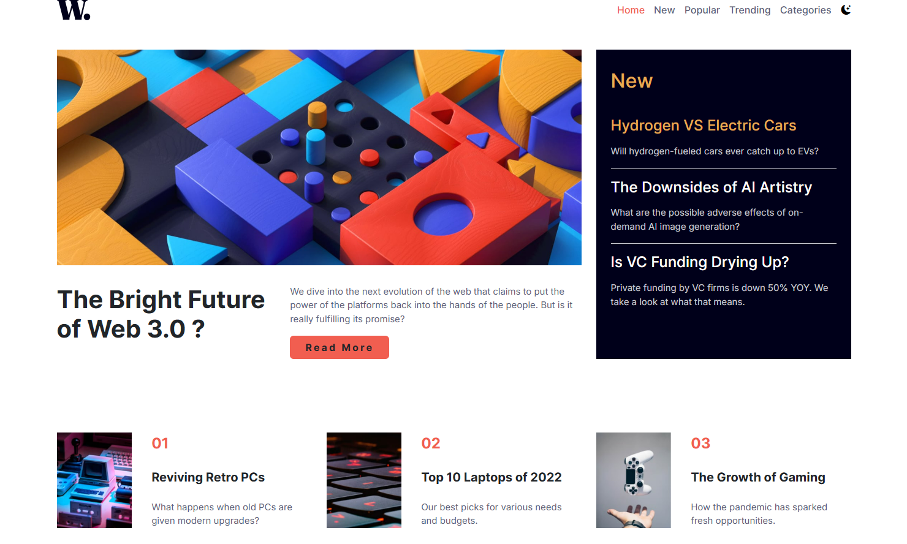

# Frontend Mentor - News homepage solution

This is a solution to the [News homepage challenge on Frontend Mentor](https://www.frontendmentor.io/challenges/news-homepage-H6SWTa1MFl). Frontend Mentor challenges help you improve your coding skills by building realistic projects.

## Table of contents

- [The challenge](#the-challenge)
- [Screenshot](#screenshot)
- [Built with](#built-with)
- [Author](#author)

**Note: Delete this note and update the table of contents based on what sections you keep.**

## Overview

### The challenge

Users should be able to:

- View the optimal layout for the interface depending on their device's screen size
- See hover and focus states for all interactive elements on the page
- User Can use dark mode and light mode

### Screenshot

### Links

- Solution URL: [Add solution URL here](https://your-solution-url.com)
- Live Site URL: [Add live site URL here](https://your-live-site-url.com)

### Built with

- Semantic HTML5 markup
- CSS custom properties
- Flexbox
- Mobile-first workflow
- [BootstrapCSS](https://getbootstrap.com/)
- [JQuery](https://jquery.com/) - JS library

## Author

- Website - [Yehia Zakaria](https://github.com/YehiaZakaria99)
- Frontend Mentor - [@YehiaZakaria99](https://www.frontendmentor.io/profile/YehiaZakaria99)
- Twitter - [@Yehia16199](https://x.com/Yehia16199)
